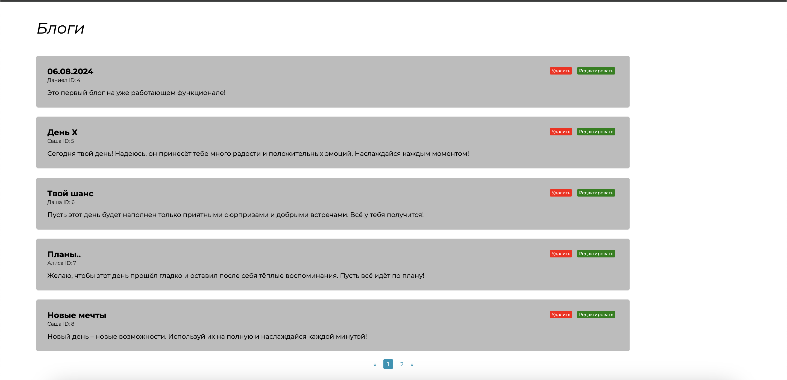

## SimplyBlog

SimplyBlog is an interactive CRUD application and features for your things.


## The project includes:

- Home page: User-friendly interface for quickly and easily finding the products you need.
- CRUD functionality: Ability to add, view, update, and delete product information.


## Installation

1. Clone the repository:
    ```
      git clone https://github.com/username/repository.git
    ```
2. Go to the project directory:
    ```
      cd repository
    ```
3. Install Composer:
    ```
        composer install
    ```
3. Setting up the .env file:
    ```
        cp .env.example .env
    ```
3. Running Migrations:
    ```
        php artisan migrate
    ```
3. Starting the server:
    ```
        php artisan serve
    ```
    

## Technologies

- HTML
- CSS
- PHP
- Laravel
- mySQL


## Screenshots
<p align="center">
  
  
  
</p>
